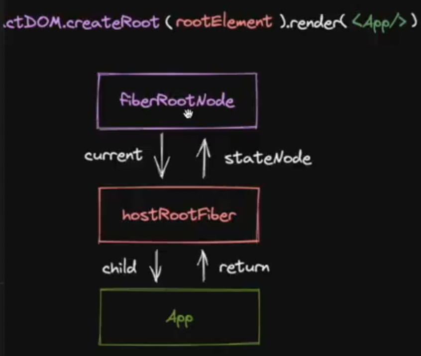

# React 源码

## 项目构建

### Multi-repo 和 Mono-repo

> Multi-repo 每个库有自己独立的仓库, 逻辑清晰, 相对应的列酮管理会更繁琐
> Mono-repo 可以很方便的协同管理不同独立的库的生命周期, 相对应的, 会有更高的操作复杂度

### Mono-repo 技术选型

简单工具

- npm: workspace
- yarn: workspace
- pnpm: workspace

专业工具

- nx
- bit
- turborepo
- rush
- lerna

### pnpm 相对其他包管理工具的优势:

- 依赖安装快
- 更规范(处理幽灵依赖问题: 没有显示声明, 但是被安装的依赖)

### 开发规范

#### 安装 eslint

> pnpm add -D -w(根目录安装 Mono-repo 规范下使用) @typescript-eslint/eslint-plugin @typescript-eslint/parser eslint eslint-config-prettier eslint-plugin-prettier (prettier 的包是为了防止 eslint 和 prettier 规范代码冲突, 相当于合并规范了)

.eslintrc.json 文件

```json
{
	"env": {
		"browser": true,
		"es2021": true,
		"node": true,
		"jest": true
	},
	"extends": [
		"eslint:recommended",
		"plugin:@typescript-eslint/recommended",
		"prettier",
		"plugin:prettier/recommended"
	],
	"parser": "@typescript-eslint/parser",
	"parserOptions": {
		"ecmaVersion": "latest",
		"sourceType": "module"
	},
	"plugins": ["@typescript-eslint", "prettier"],
	"rules": {
		"prettier/prettier": "error",
		"no-case-declarations": "off",
		"no-constant-condition": "off",
		"@typescript-eslint/ban-ts-comment": "off",
		"@typescript-eslint/no-unused-vars": "off",
		"@typescript-eslint/no-var-requires": "off",
		"no-unused-vars": "off"
	}
}
```

package.json 文件

```json
		"lint": "eslint --ext .ts,.jsx,.tsx(包含的文件) --fix(修复代码) --quiet ./packages(哪个目录下)"

```

#### 代码风格 prettier

- 安装

```json
    pnpm add prettier -D -w
```

新建.prettierrc.json 文件

```json
{
	"printWidth": 80,
	"tabWidth": 2,
	"useTabbs": true,
	"singleQuote": true,
	"semi": true,
	"trailingComma": "none",
	"bracketSpacing": true
}
```

#### commot 规范检查

安装 husky, 用于拦截 commit 命令

> pnpm add husky -D -w

初始化 husky

> npx husky init

将刚才实现的格式化命令 pnpm lint 纳入 commit 时 husky 将执行的脚本

> npx husky add .husky/pre-commit "pnpm lint(执行脚本)"

或者直接创建 pre-commit 文件

```shell
#!/usr/bin/env sh
. "$(dirname -- "$0")/_/husky.sh"

pnpm lint
pnpm run tsc
```

> TODO: pnpm lint 会对代码全量检查, 当项目复杂后执行速度可能比较慢, 届时可以考虑使用 lint-staged, 实现支队暂缓区代码践行检查.

通过 commitlint 对 git 提交信息进行检查,首先安装必要的库:

> pnpm add -D -w commitlint @commitlint/cli @commitlint/config-conventional

新建配置文件.commitlintrc.js

```js
module.exports = {
	extends: ['@commitlint/config-conventional']
};
```

集成到 husky 中

> npx husky add .husky/commit-msg "npx --no--install commitlint -e $HUSKY_GIT_PARAMS"

conventional 规范集意义:

> 提交类型: 摘要信息
> <type>:<subject>

常用的 type 值包括如下:

- feat: 添加新功能

- fix: 修复 BUG

- chore: 一些不影响功能的更改

- docs: 专指文档的修改

- pref: 性能方面的优化

- refactor: 代码重构

- test: 添加一些测试代码等等

typescript 配置

```json
{
	"compileOnSave": true,
	"include": ["./packages/**/*"],
	"compilerOptions": {
		"target": "ESNext",
		"useDefineForClassFields": true,
		"module": "ESNext",
		"lib": ["ESNext", "DOM"],
		"moduleResolution": "Node",
		"strict": true,
		"sourceMap": true,
		"resolveJsonModule": true,
		"isolatedModules": true,
		"esModuleInterop": true,
		"noEmit": true,
		"noUnusedLocals": false,
		"noUnusedParameters": false,
		"noImplicitReturns": false,
		"skipLibCheck": true,
		"baseUrl": "./packages",
		"paths": {
			"hostConfig": ["./react-dom/src/hostConfig.ts"]
		}
	}
}
```

## React 项目结构

- react(宿主环境无关的公用方法)
- react-reconciler (协调器的实现, 宿主环境无关)
- 各种宿主环境的包
- shared (公用辅助方法, 宿组环境无关)

### JSX 转换是什么

JSX 转换 playground

```jsx
import { jsx as _jsx } from 'react/jxs-runtime';

/*#PURE__*/ _js('div', {
	children: '123'
});
```

包括两部分

- 编译时
- 运行时: jsx 方法或 React.createElement 方法的实现(包括 dev、prod 两个环境)

编译时由 babel 编译实现, 我们来实现运行时, 工作量包括:

1. 实现 jsx 方法
2. 实现打包流程
3. 实现调试打包结果的环境

### 实现 jsx 方法

包括:

- jsx DEV 方法(dev 环境)
- jsx 方法 (prod 环境)
- React.createElement 方法

### 实现打包流程

对应上述 3 方法,打包对象文件

- react/jsx-dev-runtime.js (dev 环境)
- react/jsx-rumtime.js (prod 环境)
- React

### 调试打包结果

my-react -> 打包 -> react 包 -> 执行 pnpm link --global -> react 包(全局 node-modules) -> pnpm link react --global -> Demo(原生 react 生成的项目, 在 my-react 同级文件夹下创建) 这时就可以调试自己写的源代码了

## 初探 reconciler

reconciler 是 React 核心逻辑所在的模块,中文名叫协调器,协调(reconciler) 就是 diff 算法的意思.

### reconciler 有什么用?

- 前端框架结构与工作原理

  > 描述 UI(JSX, template) -> 编译优化 -> 运行时核心模块(vue: render; react: reconciler) -> 调用 -> 宿主环境 API -> 显示真实页面

  - 消费 JSX
  - 没有编译优化
  - 开放通用 API 共不同宿主环境使用

#### 核心模块消费 JSX 的过程

##### 核心模块操作的数据结构是?

当前已知的数据结构: React Element(JSX 转换 playground)
React Element 如果作为核心模块操作的数据结构, 存在的问题:

- 无法表达节点之间的关系
- 字段有限, 不好拓展(比如: 无法表达状态)

所以,需要一种新的数据结构, 他的特点:

- 介于 React Element 与真实 UI 节点之间
- 能够表达节点之间的关系
- 方便拓展(不仅作为数据存储单元, 也能作为工作单元)

这就是 FiberNode (虚拟 DOM 在 React 中的实现)
当前我们了解的节点类型:

- JSX
- React Element
- FiberNode
- DOM Element

#### reconciler 的工作方式

对于同一个节点,比较其 React Element 与 fiberNode, 生成子 fiberNode. 并根据比较的结果生成不同标记(插入, 删除, 移动...),对应不同宿主环境 API 的执行

> React Element -> 比较 -> Fiber Node -> 产生标记
> 子 React Element -> 比较 -> 子 Fiber Node -> 产生标记
> ...

比如, 挂载<div></div>

```js
// React Element
jsx('div');

// Fiber Node
null;
// 生成子fiberNode
// 对应标记
Placement;
```

将 <div></div> 更新为<p></p>

```js
// React Element
jsx("p")

// Fiber Node
FiberNode {type: "div"}
// 生成子fiberNode
// 对应标记
Deletetion Placement
```

当所有 React Element 比较完后,会生成一颗 fiberNode 树, 一共会存在两颗 fiberNode 树:

- current: 与视图中真实 UI 对应的 fiberNode 树.
- workInProgress: 触发更新后, 正在 reconciler 中计算的 fiberNode 树

双缓冲技术介绍(百度查)

## JSX 消费的顺序

以 DFS(深度优先遍历)的顺序遍历 React Element, 这意味着:

- 如果有子节点, 遍历子节点; (beginWork 过程)
- 如果没有子节点, 遍历兄弟节点; (completeUnitOfWork 过程)

这是个递归的过程, 存在递、归两个阶段

- 递: 对应 beginWork
- 归: 对应 completeWork

### 如何触发更新

常见的触发更新的方式:

- ReactDom.createRoot().render(老版的 ReactDOM.render)
- this.setState
- useState 的 dispath 方法

希望实现一套统一的更新机制, 他的特点是:

- 兼容上述触发更新的方式
- 方便后续扩展 (优先级机制...)

更新机制的组成部分

- 代表更新的数据结构 --Update
- 消费 update 的数据结构 -- UpdateQueue

```js
UpdateQueue = [shared.pending: [update, update] ]
```

接下来的工作包括:

- 实现 mount 时调用的 API
- 将该 API 接入上述更新机制中

需要考虑的事情:

- 更新可能发生于任意组件, 而更新流程是从根节点递归的
- 需要一个统一的根节点保存通用信息

```jsx
ReactDom.createRoot(rootElement).render(<App />);
```



## 初探mount流程

更新流程的目的:

- 生成wip fiberNode树
- 标记副作用flags

更新流程的步骤:

- 递: beginWork
- 归: completeWork

### beginWork

对于如下结构的reactElement:

````react
<A>
	<B />
</A>
````

当进入A的beginWork时. 通过对比B current fiberNode与B  , 生成B对应tip fiberNode. 在此过程中最多会标记2类与 [结构变化] 相关的flags: 

- Placement
  - 插入: a -> ab 移动: abc -> bca
- ChildDeletion
  -  删除 ul > li * 3 -> ul > li * 1

不包含与 [属性变化] 相关的flag:

- Update

  ````react
   -> 
  ````

### 实现与Host相关节点的beginWork

首先, 为开发环境增加\__DEV\__标识, 方便DEV包打印更多信息:

> pnpm i -d -w @rollup/plugin-replace

HostRoot的beginWork工作流程;(updateHostRoot)

1. 计算状态的最新值
2. 创造子fiberNode

HostComponent的beginWork工作流程;(updateHostComponent)

1. 创造子fiberNode

HostText没有beginWork工作流程(因为他没有子节点)()

````react
<p>张三</p>
````

### beginWork

考虑如下结构的reactElement;

````react
<div>
	<p>张三</p>
	<span>两年半</span>
<div>
````

理论上mount流程完毕后包含的flags: (ChildReconciler) 

- 两年半 Placement
- span Placement
- 张三 Placement
- p Placement
- div Placement

相比于执行5次Placement. 我们可以构建好  [离屏DOM树] 后, 对div执行1次Placement操作

### completeWork

需要解决的问题: 

- 对于Host类型fiberNode: 构建离屏DOM树(flags 为Placement)
- 标记Update flag (TODO)

complete性能优化策略

flags分布在不同fiberNode中, 如何快速找到他们?

答案: 利用completeWork向上遍历(归)的流程, 将子fiberNode的flags冒泡到父fiberNode (bubbleProperties)

## 初探ReactDOM

react内部3个阶段

- shcedule阶段 ( 调度阶段 )
- render阶段 (beginWork; complateWork)
- commit阶段  (commitRoot)

## commit 阶段的3个子阶段

- beforeMutation阶段
- mutation阶段
- latouy阶段

### 当前 阶段要执行的任务

1. fiber树的切换
2. 执行Placement对应操作

需要注意的问题. 考虑如下JSX如何span含有flag, 该如何找到他

````html
<App>
	<div>
		<span>张三</span>
	</div>
</App>
````

### 打包ReactDOM

需要注意的点:

- 兼容原版react的导出

- 处理hostConfig的指向

  >  pnpm i -d -w @rollup/plugin-alias. 路径别名

## 初探FC与实现第二种调试方式

FunctionComponent 需要考虑的问题

- 如何支持FC?
- 如何组织Hooks?

### 如何支持FC?

FC的工作同样植根于: 

- beginWork
- completeWork

### 第二种调试方式

采用vie的实时调试, 他的好处是 [ 实时看到源码运行效果 ]


