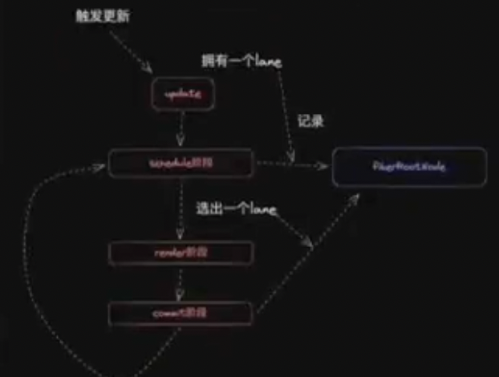

# React 源码

## 项目构建

### Multi-repo 和 Mono-repo

> Multi-repo 每个库有自己独立的仓库, 逻辑清晰, 相对应的列酮管理会更繁琐
> Mono-repo 可以很方便的协同管理不同独立的库的生命周期, 相对应的, 会有更高的操作复杂度

### Mono-repo 技术选型

简单工具

- npm: workspace
- yarn: workspace
- pnpm: workspace

专业工具

- nx
- bit
- turborepo
- rush
- lerna

### pnpm 相对其他包管理工具的优势:

- 依赖安装快
- 更规范(处理幽灵依赖问题: 没有显示声明, 但是被安装的依赖)

### 开发规范

#### 安装 eslint

> pnpm add -D -w(根目录安装 Mono-repo 规范下使用) @typescript-eslint/eslint-plugin @typescript-eslint/parser eslint eslint-config-prettier eslint-plugin-prettier (prettier 的包是为了防止 eslint 和 prettier 规范代码冲突, 相当于合并规范了)

.eslintrc.json 文件

```json
{
	"env": {
		"browser": true,
		"es2021": true,
		"node": true,
		"jest": true
	},
	"extends": [
		"eslint:recommended",
		"plugin:@typescript-eslint/recommended",
		"prettier",
		"plugin:prettier/recommended"
	],
	"parser": "@typescript-eslint/parser",
	"parserOptions": {
		"ecmaVersion": "latest",
		"sourceType": "module"
	},
	"plugins": ["@typescript-eslint", "prettier"],
	"rules": {
		"prettier/prettier": "error",
		"no-case-declarations": "off",
		"no-constant-condition": "off",
		"@typescript-eslint/ban-ts-comment": "off",
		"@typescript-eslint/no-unused-vars": "off",
		"@typescript-eslint/no-var-requires": "off",
		"no-unused-vars": "off"
	}
}
```

package.json 文件

```json
		"lint": "eslint --ext .ts,.jsx,.tsx(包含的文件) --fix(修复代码) --quiet ./packages(哪个目录下)"

```

#### 代码风格 prettier

- 安装

```json
    pnpm add prettier -D -w
```

新建.prettierrc.json 文件

```json
{
	"printWidth": 80,
	"tabWidth": 2,
	"useTabbs": true,
	"singleQuote": true,
	"semi": true,
	"trailingComma": "none",
	"bracketSpacing": true
}
```

#### commot 规范检查

安装 husky, 用于拦截 commit 命令

> pnpm add husky -D -w

初始化 husky

> npx husky init

将刚才实现的格式化命令 pnpm lint 纳入 commit 时 husky 将执行的脚本

> npx husky add .husky/pre-commit "pnpm lint(执行脚本)"

或者直接创建 pre-commit 文件

```shell
#!/usr/bin/env sh
. "$(dirname -- "$0")/_/husky.sh"

pnpm lint
pnpm run tsc
```

> TODO: pnpm lint 会对代码全量检查, 当项目复杂后执行速度可能比较慢, 届时可以考虑使用 lint-staged, 实现支队暂缓区代码践行检查.

通过 commitlint 对 git 提交信息进行检查,首先安装必要的库:

> pnpm add -D -w commitlint @commitlint/cli @commitlint/config-conventional

新建配置文件.commitlintrc.js

```js
module.exports = {
	extends: ['@commitlint/config-conventional']
};
```

集成到 husky 中

> npx husky add .husky/commit-msg "npx --no--install commitlint -e $HUSKY_GIT_PARAMS"

conventional 规范集意义:

> 提交类型: 摘要信息
> <type>:<subject>

常用的 type 值包括如下:

- feat: 添加新功能

- fix: 修复 BUG

- chore: 一些不影响功能的更改

- docs: 专指文档的修改

- pref: 性能方面的优化

- refactor: 代码重构

- test: 添加一些测试代码等等

typescript 配置

```json
{
	"compileOnSave": true,
	"include": ["./packages/**/*"],
	"compilerOptions": {
		"target": "ESNext",
		"useDefineForClassFields": true,
		"module": "ESNext",
		"lib": ["ESNext", "DOM"],
		"moduleResolution": "Node",
		"strict": true,
		"sourceMap": true,
		"resolveJsonModule": true,
		"isolatedModules": true,
		"esModuleInterop": true,
		"noEmit": true,
		"noUnusedLocals": false,
		"noUnusedParameters": false,
		"noImplicitReturns": false,
		"skipLibCheck": true,
		"baseUrl": "./packages",
		"paths": {
			"hostConfig": ["./react-dom/src/hostConfig.ts"]
		}
	}
}
```

## React 项目结构

- react(宿主环境无关的公用方法)
- react-reconciler (协调器的实现, 宿主环境无关)
- 各种宿主环境的包
- shared (公用辅助方法, 宿组环境无关)

### JSX 转换是什么

JSX 转换 playground

```jsx
import { jsx as _jsx } from 'react/jxs-runtime';

/*#PURE__*/ _js('div', {
	children: '123'
});
```

包括两部分

- 编译时
- 运行时: jsx 方法或 React.createElement 方法的实现(包括 dev、prod 两个环境)

编译时由 babel 编译实现, 我们来实现运行时, 工作量包括:

1. 实现 jsx 方法
2. 实现打包流程
3. 实现调试打包结果的环境

### 实现 jsx 方法

包括:

- jsx DEV 方法(dev 环境)
- jsx 方法 (prod 环境)
- React.createElement 方法

### 实现打包流程

对应上述 3 方法,打包对象文件

- react/jsx-dev-runtime.js (dev 环境)
- react/jsx-rumtime.js (prod 环境)
- React

### 调试打包结果

my-react -> 打包 -> react 包 -> 执行 pnpm link --global -> react 包(全局 node-modules) -> pnpm link react --global -> Demo(原生 react 生成的项目, 在 my-react 同级文件夹下创建) 这时就可以调试自己写的源代码了

## 初探 reconciler

reconciler 是 React 核心逻辑所在的模块,中文名叫协调器,协调(reconciler) 就是 diff 算法的意思.

### reconciler 有什么用?

- 前端框架结构与工作原理

  > 描述 UI(JSX, template) -> 编译优化 -> 运行时核心模块(vue: render; react: reconciler) -> 调用 -> 宿主环境 API -> 显示真实页面

  - 消费 JSX
  - 没有编译优化
  - 开放通用 API 共不同宿主环境使用

#### 核心模块消费 JSX 的过程

##### 核心模块操作的数据结构是?

当前已知的数据结构: React Element(JSX 转换 playground)
React Element 如果作为核心模块操作的数据结构, 存在的问题:

- 无法表达节点之间的关系
- 字段有限, 不好拓展(比如: 无法表达状态)

所以,需要一种新的数据结构, 他的特点:

- 介于 React Element 与真实 UI 节点之间
- 能够表达节点之间的关系
- 方便拓展(不仅作为数据存储单元, 也能作为工作单元)

这就是 FiberNode (虚拟 DOM 在 React 中的实现)
当前我们了解的节点类型:

- JSX
- React Element
- FiberNode
- DOM Element

#### reconciler 的工作方式

对于同一个节点,比较其 React Element 与 fiberNode, 生成子 fiberNode. 并根据比较的结果生成不同标记(插入, 删除, 移动...),对应不同宿主环境 API 的执行

> React Element -> 比较 -> Fiber Node -> 产生标记
> 子 React Element -> 比较 -> 子 Fiber Node -> 产生标记
> ...

比如, 挂载<div></div>

```js
// React Element
jsx('div');

// Fiber Node
null;
// 生成子fiberNode
// 对应标记
Placement;
```

将 <div></div> 更新为<p></p>

```js
// React Element
jsx("p")

// Fiber Node
FiberNode {type: "div"}
// 生成子fiberNode
// 对应标记
Deletetion Placement
```

当所有 React Element 比较完后,会生成一颗 fiberNode 树, 一共会存在两颗 fiberNode 树:

- current: 与视图中真实 UI 对应的 fiberNode 树.
- workInProgress: 触发更新后, 正在 reconciler 中计算的 fiberNode 树

双缓冲技术介绍(百度查)

## JSX 消费的顺序

以 DFS(深度优先遍历)的顺序遍历 React Element, 这意味着:

- 如果有子节点, 遍历子节点; (beginWork 过程)
- 如果没有子节点, 遍历兄弟节点; (completeUnitOfWork 过程)

这是个递归的过程, 存在递、归两个阶段

- 递: 对应 beginWork
- 归: 对应 completeWork

### 如何触发更新

常见的触发更新的方式:

- ReactDom.createRoot().render(老版的 ReactDOM.render)
- this.setState
- useState 的 dispath 方法

希望实现一套统一的更新机制, 他的特点是:

- 兼容上述触发更新的方式
- 方便后续扩展 (优先级机制...)

更新机制的组成部分

- 代表更新的数据结构 --Update
- 消费 update 的数据结构 -- UpdateQueue

```js
UpdateQueue = [shared.pending: [update, update] ]
```

接下来的工作包括:

- 实现 mount 时调用的 API
- 将该 API 接入上述更新机制中

需要考虑的事情:

- 更新可能发生于任意组件, 而更新流程是从根节点递归的
- 需要一个统一的根节点保存通用信息

```jsx
ReactDom.createRoot(rootElement).render(<App />);
```


## 初探mount流程

更新流程的目的:

- 生成wip fiberNode树
- 标记副作用flags

更新流程的步骤:

- 递: beginWork
- 归: completeWork

### beginWork

对于如下结构的reactElement:

````react
<A>
	<B />
</A>
````

当进入A的beginWork时. 通过对比B current fiberNode与B  , 生成B对应tip fiberNode. 在此过程中最多会标记2类与 [结构变化] 相关的flags: 

- Placement
  - 插入: a -> ab 移动: abc -> bca
- ChildDeletion
  -  删除 ul > li * 3 -> ul > li * 1

不包含与 [属性变化] 相关的flag:

- Update

  ````react
   -> 
  ````

### 实现与Host相关节点的beginWork

首先, 为开发环境增加\__DEV\__标识, 方便DEV包打印更多信息:

> pnpm i -d -w @rollup/plugin-replace

HostRoot的beginWork工作流程;(updateHostRoot)

1. 计算状态的最新值
2. 创造子fiberNode

HostComponent的beginWork工作流程;(updateHostComponent)

1. 创造子fiberNode

HostText没有beginWork工作流程(因为他没有子节点)()

````react
<p>张三</p>
````

### beginWork

考虑如下结构的reactElement;

````react
<div>
	<p>张三</p>
	<span>两年半</span>
<div>
````

理论上mount流程完毕后包含的flags: (ChildReconciler) 

- 两年半 Placement
- span Placement
- 张三 Placement
- p Placement
- div Placement

相比于执行5次Placement. 我们可以构建好  [离屏DOM树] 后, 对div执行1次Placement操作

### completeWork

需要解决的问题: 

- 对于Host类型fiberNode: 构建离屏DOM树(flags 为Placement)
- 标记Update flag (TODO)

complete性能优化策略

flags分布在不同fiberNode中, 如何快速找到他们?

答案: 利用completeWork向上遍历(归)的流程, 将子fiberNode的flags冒泡到父fiberNode (bubbleProperties)

## 初探ReactDOM

react内部3个阶段

- shcedule阶段 ( 调度阶段 )
- render阶段 (beginWork; complateWork)
- commit阶段  (commitRoot)

## commit 阶段的3个子阶段

- beforeMutation阶段
- mutation阶段
- latouy阶段

### 当前 阶段要执行的任务

1. fiber树的切换
2. 执行Placement对应操作

需要注意的问题. 考虑如下JSX如何span含有flag, 该如何找到他

````html
<App>
	<div>
		<span>张三</span>
	</div>
</App>
````

### 打包ReactDOM

需要注意的点:

- 兼容原版react的导出

- 处理hostConfig的指向

  >  pnpm i -d -w @rollup/plugin-alias. 路径别名

## 初探FC与实现第二种调试方式

FunctionComponent 需要考虑的问题

- 如何支持FC?
- 如何组织Hooks?

### 如何支持FC?

FC的工作同样植根于: 

- beginWork
- completeWork

### 第二种调试方式

采用vite的实时调试, 他的好处是 [ 实时看到源码运行效果 ]

## 实现 useState

hook脱离FC上下文, 仅仅是普通函数, 如何让他拥有感知上下文环境的能力?

比如说:  

- Hook如何知道在另一个Hook的上下文环境内执行

  ````react
  function App() {
  	useEffect(() => {
  		// 执行 useSstate时怎么知道在useEffect中执行?
  		useState(0);
  	})
  }
  ````

- Hook怎么知道当前的mount还是update?

- 解决方案: 在不同上下文中调用的Hook不是同一个函数

  

  实现 「内部数据共享层」 是的注意事项:

  - 以浏览器举例, Reconciler + hostConfig = ReactDom

  - 增加 「内部数据共享层」, 意味着Reconciler与React产生关联, 进而意味着ReactDOM与React产生.

  - 如果两个包「产生关联」, 在打包时需要考虑: 两则的代码时打包在一起还是分开?

  - 如何打包在一起, 意味着打包后的ReactDOM中会包含一个内部数据共享层, React中也会包含一个内部数据共享层, 这两者不是同一个内部数据共享层

  - 而我们希望两者共享数据, 所以不希望ReactDOM中会包含React得代码

    - Hook如何知道自身数据保存在那?

      ````react
      function App() {
      	useEffect(() => {
      		// 执行 useSstate时怎么知道在useEffect中执行?
      		useState(0);	
      	})
      }
      ````

### 实现Hooks的数据结构

fiberNode中可用的字段:

- memoizedState

- updateQueue

  > FC FiberNode -> memoizedState -> Hooks(useState) -> hook数据

 对于FC对应的fiberNode, 存在两成数据:

- fiberNode.memoizedState对应Hooks链表
- 链表中每个hook对应自身的数据

### 实现useState

包括2方面工作:

1. 实现mount时useState的实现
2. 实现dispatch方法, 并接入现有更新流程内

## ReactElement 的测试用例

我们将实现第三种调试方式——用例调试, 包括三部分内容:

- 实现第一个测试工具test-utils
- 实现测试环境
- 实现ReactElement

与测试相关的代码都来自React仓库, 可以先把React仓库下载下来:

> git clone 

### 实现test-utils

这是用于测试的工具集, 来源自ReactTestUtils.js, 特点是: 使用ReactDOM作为宿主环境

## 初探update流程

update流程与mount流程的区别

对于beginWork:

- 需要处理childDeletion的情况
- 需要处理节点移动的情况

对于completeWork:

- 需要处理HostText内容更新的情况
- 需要处理HostComponent属性变化的情况

对于commitWork:

- 对于childDeletion, 需要遍历被删除的子树

useState

- 实现相对于mountState的updateState

### beginWork流程

这里处理单一节点, 所以省去了「节点移动」的情况. 我们需要处理

- singleElement (reconcileSingleElement)
- singleTextNode (reconcileSingleTextNode)

处理流程为:

- 比较是否可以复用current fiber

  - 比较key, 如果key不同, 不能复用
  - 比较type, 如果type不同, 不能复用
  - 如果key与type都相同, 则可复用

- 不能复用, 则创建新的(同mount流程), 可以复用则复用旧的

  > 注意: 对于同一个fiberNode, 即使反复更新, current 、 wip这两个fiberNode会重复使用

### completeWork流程

主要处理「标记Update」的情况, 我们处理HostText内容更新的情况.

### commitWork

对于标记ChildDeteletion的子树, 由于子树中: 

- 对于FC, 需要处理useEffect unmount执行、 解绑ref
- 对于HostComponent, 需要解绑ref
- 对于子树的「根HostComponent」, 需要移除DOM

所以需要实现「遍历ChildDeletion子树」的流程

### 对于useState

需要实现

- 正对update时的dispatcher
- 实现对表mountWorkInProgresHook的updateWorkInProgresHook
- 实现updatState中「计算新state」的逻辑

其中updateWorkInProgresHook的实现需要考虑

- Hook 数据从哪来?

- 交互阶段触发的更新

  ````
  <div onClick={() => update(i)}>1</div>
  ````

- render 阶段触发的更新(TODO)

  ````
  function App() {
  	const [num, update] = useState(1)
  	// 触发更新
  	update(100)
  	return <div>{num}</div>
  
  ````


## 实现事件系统

时间系统本质上植根于浏览器事件模型, 所以他隶属于ReactDOM, 在实现时要做到对Reconciler 0 侵入.

实现事件系统需要考虑:

- 模拟实现浏览器事件捕获、冒泡流程.
- 实现合成事件对象
- 方便后续扩展

### 实现ReactDOM与Reconciler对接

将事件回调保存在DOM中, 通过一下两个时机对接: 

- 创建DOM时
- 更新属性时

模拟实现浏览器事件流程

> 触发事件 -> TargetElement -> Container -> 递归获取祖先元素ancestorElement -> 绑定对应的事件
>
> ***实现原理是利用事件委托机制

需要注意的点: 

- 基于事件对象实现合成事件, 以满足自定义需求 (比如阻止事件传递) 
- 方便后续扩展优先级机制

## 实现Diff算法

当前仅实现了单一节点的 增/删 操作, 即「单节点Diff算法」. 我们下面来实现「多节点的Diff算法」

### 对于 reconcileSingleElement的改动

 **一下字母代表 组件, 数字代表 key** 

当前支持的情况: ()

- A1 - B2
- A1 - A2

需要支持的情况

- ABC -> A

「单/多节点」是指「更新后是单/多节点」.

更细致的, 我们需要区别4中情况:

- key 相同,  type相同 == 复用当前节点

  > 例如: A1B2C3 -> A1。 删除B2C3

- key 相同,  type不相同 == 不存在任何复用的可能性

  > 例如: A1B2C3 -> B1

-   == 当前节点不能复用

- key不同, type不同 == 当前节点不能复用

### 对于 reconcileSingleTextNode 的改动

类型reconcileSingleElement改动

### 对于同级多节点Diff的支持

单节点需要支持的情况:

- 插入Placement
- 删除 ChildDeletion

多节点需要支持的情况:

- 插入Placement
- 删除 ChildDeletion
- 移动Placement

整体流程分为4步.

1. 将current中所有同级fiber保存在Map中
2. 遍历newChild数组, 对于每个遍历到的element, 存在两种情况
   1. 在Map中存在对应current fiber, 且可以复用
   2. 在Map中不存在对应current fiber 或 不能复用
3. 判断是插入还是移动
4. 最后Map中剩下的都标记删除

### 步骤2-- 是否复用 详解

首先, 根据key从Map中获取current fiber, 如果不存在current fiber, 则没有复用的可能.

接下来, 分情况讨论: 

- element 是 HosText, current fiber 是不是?
- element 是其他React Element, current fiber 是不是?
- TODO Element是数组或Fragment, current fiber 是不是?

### 步骤3  插入/移动判断 详解

「移动」具体是指「向右移动」

移动的判断依据: element 的 index 与 「element 对应current fiber」 index的比较

A1B2C3 -> B2 C3 A1

0   1   2         0   1   2

当遍历element时,「当前遍历到的element」 一定是「所有已遍历的element」中最靠右哪个.

所以只需要记录最后一个可复用fiber在current中的index (lastPlacedIndex), 在接下来的遍历中:

- 如果接下来遍历到的可复用fiber得index < lastPlacedIndex, 则标记Placement.
- 否则, 不标记.

### 移动操作的执行

Placement同时对应

- 移动
- 插入

对于插入操作, 之前对应的DOM方法是 parentNode.appendChild, 现在为了实现移动操作, 需要支持 parentNode.insertBefore.

parentNode.insertBefore 需要找到「目标兄弟Host节点」, 要考虑2个因素:

- 可能并不是目标 fiber 的直接兄弟节点

  ````react
  // 情况1
  <A /> <B />
  function B() {
  	return <div />
  }
  
  // 情况2
  <App /> <div />
  function App() {
    return <A />;
  }
  ````

- 不稳定的Host节点不能作为「目标兄弟Host节点」

### 不足

- 不支持数组与Fragment

  ````
  <>
  	<div></div>
  	<div></div>
  <>
  
  <ul>
  	<li></li>
  	<li></li>
  	[<li></li>, <li></li>]
  <ul>
  ````


## 实现同步调度流程

更新到底是同步还是异步?

````react
class App extends React.Component {
	onClick() {
		this.setState({a: 1})
		console.log(this.state.a)
	}
}
````

当前的现状:

- 从触发更新到render, 再到commit都是同步的
- 多次触发更新会重复多次更新流程

可以改进的地方: 多次触发更新, 只进行一次更新流程「Batched Update (批处理)」: 多次触发更新, 只进行一次更新流程

将多次更新合并为一次, 理念上优点类型防抖、节流, 我们需要考虑合并的时机是: 

- 宏任务?
- 微任务?

用三款框架实现Batched Update, 打印结果不同: 

- React
- Vue3(微任务)
- Svelte(微任务)

结论: React 批处理的时机既有宏任务, 也有微任务. 

本节课我们来实现「微任务的批处理」

### 新增调度阶段

既然我们需要「多次触发更新, 只进行一次更新流程」, 意味着我们要将更新合并, 所以在:

- render 阶段
- datcommit 阶段

的基础上增加schedule阶段 (调度阶段)

> 触发更新(dispatchState/updateContainer) -> 调度流程(sheduleUpdateOnFiber ->  renderRoot) -> commitRoot

### 对update的调整

「多次触发更新, 只进行一次更行流程」中「多次触发更新」意味着对于同一个fiber, 会创建多个update:

````react
const onClick = () => {
	updateCount((count) => count + 1)
	updateCount((count) => count + 1)
	updateCount((count) => count + 1)
}
````

「多从触发更新, 只进行一次更新流程」, 意味着要达成3个目标:

1. 需要实现一套优先级机制, 每个更新都拥有优先级
2. 需要能够合并一个宏任务/微任务中触发的所有更新
3. 需要一套算法, 用于决定那个优先级优先进入render阶段

### 实现目标1: Lane模式

包括:

- lane (二进制位, 代表优先级)
- lanes (二进制位, 代表lane的集合)

其中:

- lane作为update的优先级
- lanes作为lane的集合

### lane的产生

对于不同情况触发的更新, 产生lane. 为后续不同事件产生不同优先级更新做准备

如何知道哪些lane被消费, 还剩哪些lane没被消费?



### 对FiberRootNode 的改造

需要增加如下字段

- 代表所有未被消费的lane的集合
- 代表本次更新消费的lane

### 实现目标2、3

需要完成两件事: 

- 实现「某些判断机制」, 选出一个lane
- 显示类似防抖、节流的效果, 合并宏/微任务中触发的更新

### render阶段的改造

processUpdateQueue方法消费update时需要考虑:

- lane的因素
- update现在是一条链表, 需要遍历

### Commit阶段的改造

移除「本次更新被消费的lane」

## 实现useEffect

- 实现useEffect需要考虑的:

  - effect数据结构

    > - useEffect
    >   - memoizedState: 保存其对应的数据结构
    >   - next: 指向下一个Hook
    >   - updatQueue: 

  -  effect的工作流程如何介接入先有流程

### effect数据结构

什么事effect?

````jsx
function App() {
	useEffect(() => {
		// create
    return () => {
				// destroy
    }
	}, [xxx, aaa]);
	useLayoutEffect(() => {});
	
}

````

数据结构需要考虑:

- 不同effect可以共用同一个机制

  - useEffect
  - useLayoutEffect
  - useInsertioneffect

- 需要能保存依赖

- 需要能保存create回调

- 需要能保存destroy回调

- 需要能够区分是否需要出发create回调

  - mount时

  - 依赖变化时

    ````
    const effect = {
    	tag, // 类型
    	create, // 回调函数
    	destroy, // 副作用清除回调函数
    	deps,
    	next, // 指向下一个useEffect Hook的指针
    }
    ````

    需要区分本节课新增的3个flag:

    - 对于fiber, 新增Passive Effect, 代表「当前fiber本次更新存在副作用」
    - 对于effect hook, Passive代表「useEffect对应effect」
    - 对于effect hook, HookHasEffect代表「当前effect本次更新存在副作用」

### Effect工作流程

> render阶段
>
> ​	FC FiberNode -> 存在副作用
>
> commit阶段
>
> ​	调用副作用
>
> ​	收集回调
>
> 执行副作用

#### 调度副作用

调用需要使用Scheduler(调度器), 调度器也属于React项目下的模块.

> pnpm i -w scheduler
>
> pnpm i -D -w @type/scheduler

#### 收集回调

回调包括两类:

- create回调
- destroy回调

````react
function App() {
	const [num, updateNum] = useState(0);
	useEffect(() => {
		console.log("App mount");
	}, [])
	useEffect(() => {
		console.log("num change create", num);
		return () => {
			console.log("num change destroy", num)
		}
	}, [num])
	return (
    <div onclick={() => updateNum(num + 1)}>
    	{num === 0 ? <Child /> : "noop"}
    </div>
  )
}


function Child() {
  useEffect(() => {
    console.log("child mount");
    return () => console.log("child unmount")
  }, [])
  return 'i am child'
}
````

这意味着我们需要收集两类回调:

- unmount时执行的destroy回调
- update时执行的create回调

#### 执行副作用

本次更新的任何create回调都必须在所有上一次更新的destroy回调执行完后再执行.

整体执行流程包括: 

1. 遍历effect
2. 首先出发所有unmount effect, 且对于某个fiber, 如果触发了unmount destroy, 本次更新不会再触发update create
3. 触发所有上次更新的destroy
4. 触发所有这次更新的create

mount、update时的区别

- mount时: 一定标记Passive Effect
- update时: deps变化时标记PassiveEffect
- 


